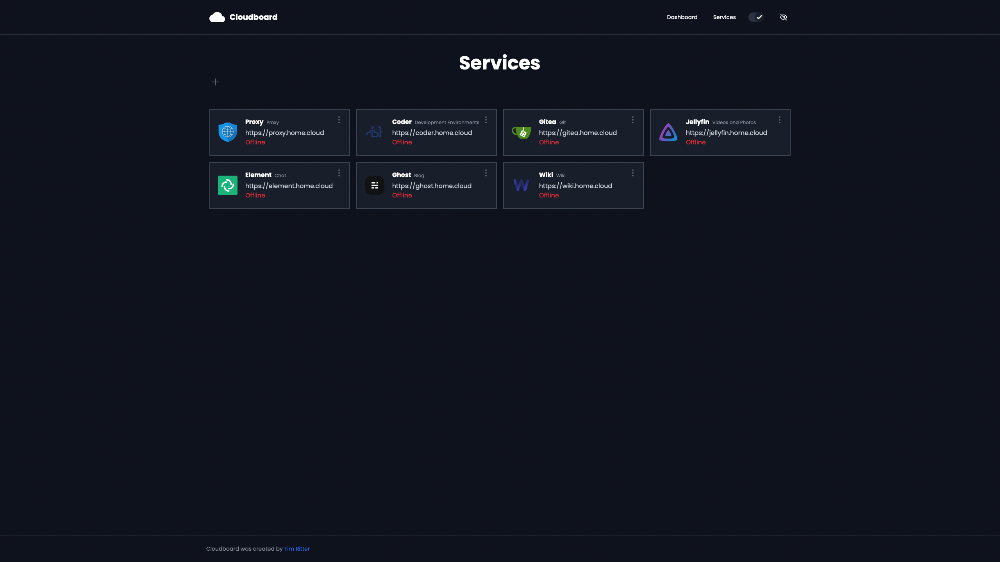

  
  <h2>Cloudboard</h2>
  
A self-hosted dashboard for services and websites

  

    <a href="https://cloudboard.tim-ritter.com">Demo</a> |
    <a href="#quickstart">Quickstart</a> |
    <a href="https://hub.docker.com/r/coyann/cloudboard">Docker</a>
  

<h2 id="quickstart">Quickstart</h2>
<h3>Docker</h3>

Cloudboard is available on Docker Hub: <a href="https://hub.docker.com/r/coyann/cloudboard">https://hub.docker.com/r/coyann/cloudboard</a>

<h3>Docker-Compose</h3>
<code>docker-compose -f docker-compose.prod.yml up</code>

<h2>Usage</h2>
<h3>Database Persistence</h3>

Cloudboard saves user data to a sqlite file. Use a docker bind mount or volume to persist <code>/app/prisma/app.db</code>.

<h2>Screenshot</h2>
